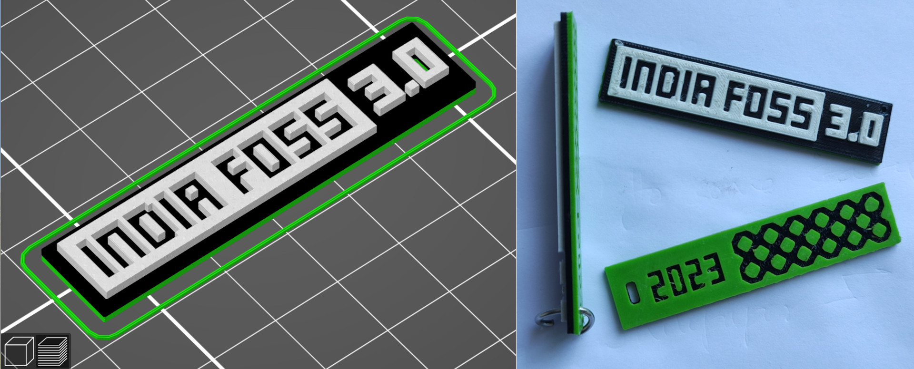
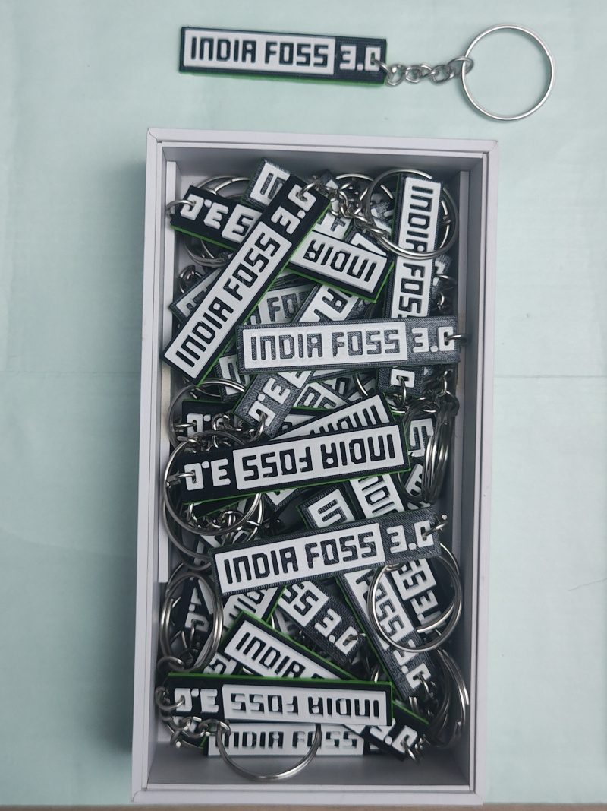
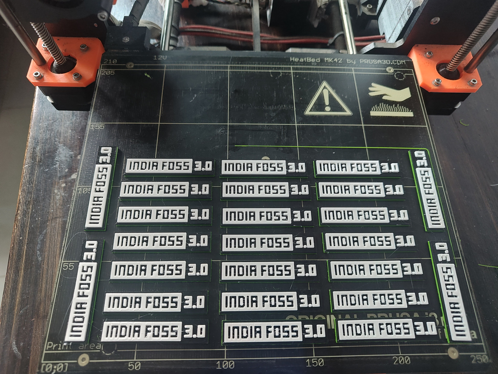

# What

Creative re-imagination the of IndiaFOSS 3.0 logo as a 3D printed keychain. Idea was to use the 3 theme colors of the conference - white, black and green.

Below image shows the design on the left, and the result on the right.

# Why

This was made as a thank you gift for volunteers of IndiaFOSS 3.0 - exclusive and one per volunteer. It was a fun project for me.

Can you guess how many are in the box above ?

<u>**Tip**</u>: while this isn't as profound a question as the "[Answer to the Ultimate Question of Life, the Universe, and Everything](https://www.scientificamerican.com/article/for-math-fans-a-hitchhikers-guide-to-the-number-42/)", the answer is the same.

# How

keychain.stl is the 3D printable design. This is generated using OpenSCAD, see logo.scad.  logo.scad is a hack. I had not much time to spend on this to clean it up, but its basically booleans.

logo.scad uses various SVG shapes.  These were generated from the IndiaFOSS 3.0 logo (in SVG format). 

3D Printing information:

- Prusa i3 MK2 Printer (single color variant, no MMU)
- 0.25 mm nozzle
- ColorFabb nGen filament colors light green, black and white
- Prusa Slicer v2.6.1
- 0.15mm OPTIMAL print setting
- "Ironing" on the topmost surface only.

Print time was roughly 40 minutes per keychain. Multiple were printed in a single shot. The longest print had 25 done in one shot. Each color takes around 6-7 hours. The number of copies was chosen to accomodate filament changes, and the printing start time was synchronized to my sleep cycle.

